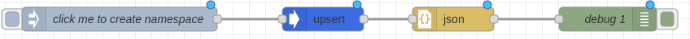
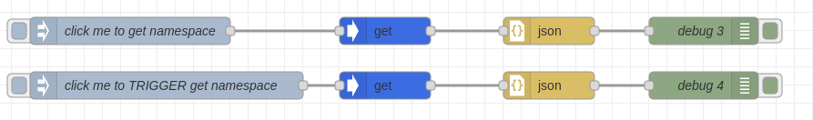
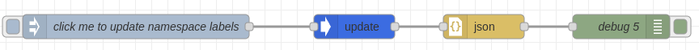
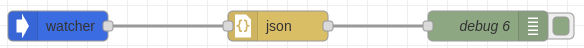

# Kube RED

Kube-RED is a set of NodeRED nodes to interact with Kubernetes. It allows to
automation of Kubernetes clusters with no or little code.

## Installation

We provide a [Helm chart](https://github.com/kube-red/node-red-k8s) to install Kube-RED in your Kubernetes cluster.

### Kube-RED nodes

Currently, we provide the following nodes:
- `upsert` - Create or update a Kubernetes resource
- `delete` - Delete a Kubernetes resource
- `get` - Get a Kubernetes resource
- `list` - List Kubernetes resources
- `create` - Create a Kubernetes resource
- `update` - Update a Kubernetes resource
- `watcher` - Watch Kubernetes resources

Configuration node `cluster-config` is required to be added to the flow to
each node. It allows configuring the Kubernetes cluster to interact either
by providing a `apiServer` URL, `username` and `password` or by using the `inCluster` option to use the
service account token of the pod Kube-RED is running in.

## Usage

By default, NodeRED manipulates objects in `msg.payload` property.
Kube-RED nodes are using `msg.object` property to store the Kubernetes object.
This way you can integrate with other nodes in the flow.

### Upsert

Upsert node allows to create or update of Kubernetes resource. It uses the
`create` and `update` verbs under the hood.

Object to be created or updated is stored in `msg.object` property and is injected
using `inject` node.

See `docs/examples/upsert.json` for an example flow.

### Get/List/Delete

Get/List/Delete node allows primitive operations on Kubernetes resources.
You can get resources using 2 ways:
1. By providing a `version`, `kind` `name` and `namespace` in `inject` node `msg.object` payload
2. By configuring the node with `version`, `kind` `name` and `namespace` inside the node itself.

Using `1` you can dynamically get a resource based on the `msg.object` payload, whereas using `2` you can
statically configure the node to get a resource when input is triggered.

See `docs/examples/get.json` for an example flow.

### Update

Update node allows updating Kubernetes resources. It uses the `patch` verb under the hood.
So when you have a complex update scenario, you can provide a partial object in `msg.object` payload
as long as it has `apiVersion`, `kind`, `metadata.name` and `metadata.namespace` will patch the resource.

See `docs/examples/update.json` for an example flow.

### Watcher

Watcher node allows watching Kubernetes resources. It uses the `watch` verb under the hood.
It works by configuring the node with `version`, `kind` `name` and `namespace` inside the node itself.
When the resource is updated, the node will emit a message with the updated object in `msg.object` property.

Note: Values in watcher should be lowercase and plural to match Kubernetes API. For example, `Deployment` should be `deployments`.

See `docs/examples/watcher.json` for an example flow.

